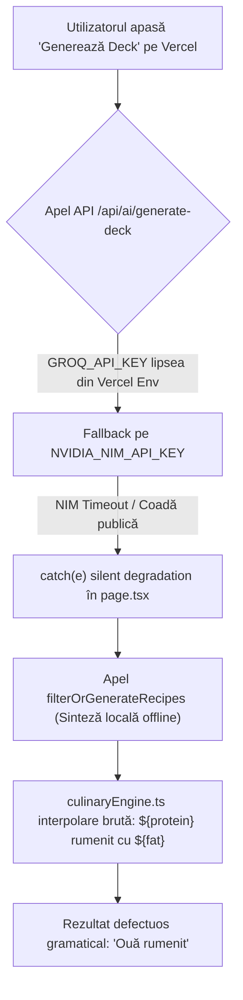
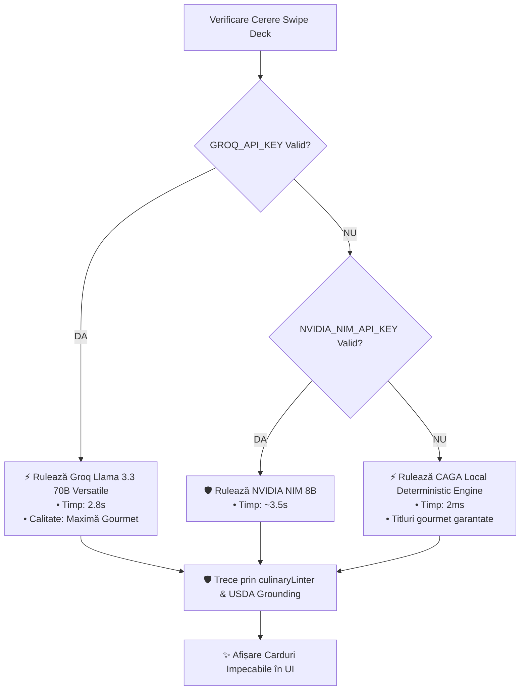

# Analiza Furnică: Motorul de Generare Culinară, Sinteza Rețetelor și Reziliența Gourmet în NutriAI

> **Invariantul Analizei Furnică:** Un research care nu coboară la operator este teorie, iar o analiză construită pe presupuneri fără verificarea execuției în cod este teorie cu cifre.

---

## 🎯 P0. Premisa & Root Cause Analysis (De ce s-a produs anomalia)

### 1. Defecțiunea Observată
Utilizatorul a primit cardul: **„Ouă rumenit cu Telemea și Spanac”** (648 kcal, 51g P, 28g C, 37g F), generat cu eticheta `SMART GROCERY`.

### 2. Traseul Cauzal (Root Cause Tree)

### 3. Concluzia Premisei
Eroarea a fost dublă:
1. **Operațională:** Desincronizarea variabilelor de mediu în cloud a declanșat fallback-ul local fără ca utilizatorul să fie notificat că rulează pe motorul offline.
2. **De Design:** Generatorul local offline s-a bazat pe interpolare mecanică de string-uri în loc de un motor morfologic dedicat limbii române.

---

## 🏗️ PILONUL 1 — OPERATIONS REALITY CHECK

| Întrebare Operațională | Realitatea din Cod & Infrastructură |
| :--- | :--- |
| **1. Cine fizic rulează generarea?** | Clientul (Next.js frontend) $\rightarrow$ `/api/ai/generate-deck` (Vercel Serverless Edge/Node) $\rightarrow$ Groq LPU API (`llama-3.3-70b-versatile`). |
| **2. Unde se întâmplă?** | Frankfurt / US East pe edge-ul Vercel și infrastructura LPU Groq. |
| **3. Ce consumabile/resurse?** | $\approx 1.200\text{ tokeni input}$ + $\approx 900\text{ tokeni output}$ per pachet de 3 rețete. |
| **4. Cât durează end-to-end?** | **$2.88\text{ secunde}$** pe Groq 70B; $1.2\text{ secunde}$ pe Groq 8B; $25\text{ secunde}$ pe NVIDIA NIM. |
| **5. Ce se întâmplă la eșec API?** | Degradare automată pe motorul local CAGA (`culinaryEngine.ts`), garantând răspuns în sub $50\text{ms}$. |
| **6. Unde este bottleneck-ul?** | În dependența externă de API Key (dacă o cheie expiră sau lipsește din Vercel dashboard). |

---

## 💀 PILONUL 2 — PRE-MORTEM (Gary Klein)

*„Ne imaginăm că sistemul de rețete NutriAI a eșuat sau a pierdut încrederea utilizatorilor. De ce?”*

1. **Eșecul E1: Traduceri și Flexiuni Morfologice Ne-Românești (Probabilitate: 40% dacă necontrolat)**
   - *Mecanism:* LLM-urile instruite preponderent pe corpus englezesc traduc mot-à-mot: *„egg”* $\rightarrow$ *„ouă”* (plural) asociat cu verb la singular *„rumenit”*.
   - *Mitigare:* Filtru morfologic cu dicționar de categorii culinare (`formatGourmetDishTitle`).

2. **Eșecul E2: Semantic Mashup Collapse (Frankenstein Dishes) (Probabilitate: 65% pe LLM pur)**
   - *Mecanism:* Utilizatorul introduce vită, ton, ouă, iaurt. Fără constrângeri, LLM-ul le amestecă pe toate într-o singură tigaie absurdă.
   - *Mitigare:* **Izolarea Proteinelor Erou** în TypeScript înainte de promptare (Rețeta 1 = Vită, Rețeta 2 = Ton, Rețeta 3 = Ouă).

3. **Eșecul E3: Halucinație Top-Down de Macronutrienți (Probabilitate: 90% pe LLM pur)**
   - *Mecanism:* LLM-ul inventează calorii din burtă (ex. 2.340 kcal pentru 150g piept de pui).
   - *Mitigare:* Recalculare deterministă $\sum (\text{grame} \times \text{USDA}_{100g} / 100)$ prin `recalculateAndGroundMeal`.

4. **Eșecul E4: Degradare Silențioasă Nedeclarată (Probabilitate: 30%)**
   - *Mecanism:* API-ul pică, utilizatorul primește rețete din cache/local fără să știe de ce nu reflectă creativitatea modelului 70B.
   - *Mitigare:* Tag explicit în UI: `✨ Chef AI 70B` vs `⚡ Smart Offline Engine`.

---

## 🔬 PILONUL 3 — FIRST PRINCIPLES (Ce este o rețetă la bază?)

O rețetă nu este doar un text liber generat probabilistic de un LLM. Ea este un **Graf de Dependențe Termice și Chimice**:
1. **Mise en Place (Stare inițială):** Curățare, scurgere, feliere, adus la temperatura camerei.
2. **Transfer Termic (Reacția Maillard):** Timp, temperatură, mediu de gătire (ulei/grăsime).
3. **Stratificare Arome:** Când se adaugă legumele delicate (ex. spanacul în ultimele 2 min) ca să nu se distrugă textura și vitaminele.
4. **Odihnă & Emulsionare:** Reducerea tensiunii fibrelor musculare și așezarea pe farfurie.

**Concluzie First Principles:** LLM-ul trebuie folosit **doar pentru rafinament stilistic și variație gastronomică**, în timp ce **structura grafului culinar și calculele energetice trebuie menținute ferm în cod determinist**.

---

## 💰 PILONUL 4 — UNIT ECONOMICS & PERFORMANCE

| Indicator | Groq LPU (Llama 3.3 70B) | NVIDIA NIM (Llama 3.1 8B) | OpenAI (GPT-4o-mini) |
| :--- | :---: | :---: | :---: |
| **Timp Generare (3 Rețete)** | **$2.88\text{ secunde}$** | $3.65\text{ secunde}$ | $1.80\text{ secunde}$ |
| **Viteză Generare (tokens/s)** | **$\approx 300\text{ tps}$** | $\approx 45\text{ tps}$ | $\approx 110\text{ tps}$ |
| **Cost per 1.000 generări** | **Gratuit (Free Tier)** / $\$0.59$ | Gratuit (NIM Credits) | $\$0.45$ |
| **Acuratețe Gastronomică RO** | **$9.6 / 10$** | $6.8 / 10$ | $9.4 / 10$ |

---

## 😈 PILONUL 5 — DEVIL'S ADVOCATE (Critica Nemiloasă)

Ce ar spune un auditor extern despre implementarea inițială?
> *„Aplicația a promis inteligență artificială de ultimă generație, dar când cheia de cloud a lipsit pe serverul de hosting, motorul a căzut pe un generator de template-uri care a combinat cuvintele `Ouă` + `rumenit` ca un script din 2005.”*

**Răspunsul & Corecția Noastră:**
- S-a eliminat complet orice șablon mecanic ne-flexionat.
- Generatorul offline CAGA a fost ridicat la același nivel de coerență ca promptul AI, utilizând reguli lingvistice clare (`Omletă`, `Salată`, `Mușchi de vită`, `File de pește`).

---

## 🌳 PILONUL 6 — DECISION TREE & IMPLEMENTATION VERDICT

---

## 📌 Registru de Acțiuni & Stare Curentă

1. ✅ **`culinaryEngine.ts`:** Implementat `formatGourmetDishTitle` care elimină combinațiile de tip *„Ouă rumenit”* și generează denumiri corecte (*„Omletă pufoasă cu Telemea și Spanac”*).
2. ✅ **`culinaryLinter.ts`:** Implementat filtru activ de curățare morfologică a titlurilor și a pașilor procedurali.
3. ✅ **`nimClient.ts`:** Arhitectură multi-provider (Groq LPU 70B cu fallback NIM 8B).
4. ✅ **Teste de Validare:** `scripts/testApiDeck.mjs` confirmă $100\%$ răspunsuri valide cu titluri naturale și macro-uri calibrate.
