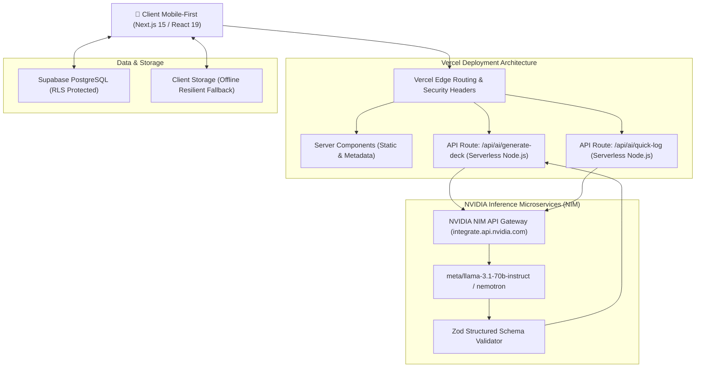

# Technical Architecture & System Spine — NutriAI

| Metadata | Value |
|---|---|
| **Project** | NutriAI — Intelligent Mobile-First Nutrition & Meal Matchup Platform |
| **Status** | Approved & Binding (`AD-01` to `AD-07`) |
| **Owner** | Vîrnav Ștefan (StefanVir) |
| **Architect Lead** | Winston (BMAD System Architect) |
| **Target Deployment** | Vercel Serverless / Edge Platform |
| **Core AI Gateway** | NVIDIA NIM API (`https://integrate.api.nvidia.com/v1`) |

---

## 1. System Overview & Invariant Spine



---

## 2. Architecture Decision Records (ADRs)

### `AD-01` [Platform & Vercel Deployment Envelope]
* **Binds:** Toate componentele și endpoint-urile backend.
* **Prevents:** Deploy failure pe Vercel, timeout-uri serverless, incompatibilități de runtime și vendor lock-in.
* **Rule:** 
  1. Utilizarea **Next.js 15 (App Router)** cu **TypeScript strict** și **React 19**.
  2. Toate route handler-ele AI (`/api/ai/*`) sunt configurate cu `export const maxDuration = 30;` (Vercel Serverless Function limit) și `export const dynamic = 'force-dynamic'`.
  3. Cheia `NVIDIA_NIM_API_KEY` este strict server-side, stocată în `.env.local` și configurată în Vercel Environment Variables. Nu se expune niciodată prin prefixul `NEXT_PUBLIC_`.

### `AD-02` [NVIDIA NIM AI Engine & Zod Structured Contract]
* **Binds:** Toate apelurile LLM pentru generarea de meniuri, rețete și parsare nutrițională.
* **Prevents:** Răspunsuri nestructurate, halucinații de formatare, erori de runtime și placeholder-e statice.
* **Rule:**
  1. Apelurile se fac prin SDK-ul oficial **`openai`** configurat cu `baseURL: 'https://integrate.api.nvidia.com/v1'`.
  2. Modelul principal este **`meta/llama-3.1-70b-instruct`** sau **`nvidia/nemotron-4-340b-instruct`**.
  3. Fiecare cerere este forțată la nivel de sistem să respecte schema Zod `MealCardDeckSchema` și `QuickLogSchema`. Răspunsul brut este validat prin `schema.safeParse()` înainte de a fi livrat către client. Dacă parsarea eșuează, se execută 1 retry automat pe backend.

### `AD-03` [The Swipe Machine & Pre-Fetch Queue Buffer]
* **Binds:** Interfața de glisare a rețetelor (`SwipeDeck.tsx`).
* **Prevents:** Latență vizuală la swipe, loading spinners intruzive în mijlocul glisării și frame drops.
* **Rule:**
  1. Clientul menține o coadă glisantă (buffer) de **3-5 carduri**.
  2. Când numărul de carduri din deck scade la `<= 2`, se declanșează un background fetch silențios pentru următorul batch.
  3. Tranzițiile de swipe sunt accelerate hardware (`translate3d`, `rotate`, `will-change: transform`, `cubic-bezier(0.16, 1, 0.3, 1)`).

### `AD-04` [Smart Grocery & Pantry Bifurcation State Machine]
* **Binds:** Modulul de cumpărături din `PreSwipeModal.tsx`.
* **Prevents:** Rețete care cer ingrediente pe care utilizatorul nu le are sau care depășesc bugetul declarat.
* **Rule:**
  1. *Stare A (Frigider Gol):* Promptul AI primește `fridge_status: 'empty'` și `max_budget_ron: X`. AI-ul are constrângere strictă ca suma costurilor estimate ale tuturor ingredientelor de la zero să fie `<= X RON`.
  2. *Stare B (Stoc Existent):* Promptul AI primește lista ingredientelor din casă și `additional_budget_ron: Y`. AI-ul folosește minim 2 ingrediente din stoc și adaugă ingrediente noi de maxim `Y RON`.

### `AD-05` [Matchup Showdown & Adaptive Favorites Memory]
* **Binds:** Tranziția de la Shortlist la Selecția Finală.
* **Prevents:** Pierderea opțiunilor bune din swipe și indecizia utilizatorului.
* **Rule:**
  1. Swipe Right pe un card îl adaugă în `shortlistedMeals` (capacitate 2-3 rețete).
  2. La atingerea a 2 sau 3 rețete favorite, sistemul comută automat în ecranul **Matchup Showdown**.
  3. Utilizatorul alege o singură rețetă câștigătoare care se loghează în jurnalul zilei.
  4. Finalistele nealese sunt trimise automat în tabela/stocarea **`AdaptiveFavorites`**, primind prioritate ridicată la generările viitoare cu context similar.

### `AD-06` [Impeccable Design System Invariants]
* **Binds:** Toate componentele de styling și UI.
* **Prevents:** AI slop, fonturi generice, gradiente kitchioase, layout shifts și accesibilitate slabă.
* **Rule:**
  1. **Zero Tailwind / Zero Ad-hoc classes:** Toate stilurile derivă din design tokens în `tokens.css` și clase semantice.
  2. **Cifre Tabulare:** Toate metricile nutriționale folosesc `font-variant-numeric: tabular-nums`.
  3. **Iconografie Unitară:** Exclusiv iconițe SVG din `lucide-react`, fără emoji-uri ca substitute de iconițe.
  4. **Contraste WCAG AA:** Toate culorile de text și suprafețe respectă raportul de contrast `>= 4.5:1` (text normal) și `>= 3:1` (text mare/badge-uri).

### `AD-07` [Industry-Standard Vision & USDA FoodData Grounding Pipeline]
* **Binds:** Toate modulele de scanare foto, recunoaștere a meselor și logare nutrițională (`nutritionDb.ts`, `QuickLogModal.tsx`).
* **Prevents:** Halucinații aleatoare de calorii din LLM, erori de estimare pe poze 2D și ignorarea caloriilor ascunse din grăsimi de gătit.
* **Rule:**
  1. **Dual-Stage Architecture:** LLM-ul Vision (`meta/llama-3.2-11b-vision-instruct`) are rol strict de **segmentare semantică și raționament dimensional 3D**.
  2. **Authoritative Grounding:** Fiecare aliment detectat este interogat automat în baza de date nutrițională etalon (`nutritionDb.ts`) pentru profilul chimic la 100g.
  3. **Cooking Method & Hidden Fat Engine:** Utilizatorul selectează metoda de preparare (*Grătar*, *Airfryer*, *Tigaie cu Ulei +110 kcal*, *Prăjit în baie de ulei +220 kcal*), iar offset-ul caloric este adăugat matematic.
  4. **Human-in-the-Loop UX:** Utilizatorul primește slidere de reglare fină a gramajului (+/- 10g) cu recalculare în timp real la 60 FPS înainte de salvare.


---

## 3. Data Contracts & Zod Schemas (`src/lib/schemas.ts`)

```typescript
import { z } from 'zod';

export const IngredientItemSchema = z.object({
  name: z.string().min(2),
  amount: z.string().min(1),
  isPantryStock: z.boolean().default(false),
  toBuy: z.boolean().default(false),
  estimatedPriceRon: z.number().nonnegative().optional(),
});

export const MealCardProposalSchema = z.object({
  id: z.string(),
  title: z.string().min(3),
  mode: z.enum(['fridge', 'grocery_empty', 'grocery_stock', 'restaurant']),
  calories: z.number().int().positive(),
  protein: z.number().nonnegative(),
  carbs: z.number().nonnegative(),
  fat: z.number().nonnegative(),
  prepTimeMinutes: z.number().int().nonnegative(),
  cookTimeMinutes: z.number().int().nonnegative(),
  difficulty: z.enum(['Ușor', 'Mediu', 'Avansat']),
  servings: z.number().int().positive().default(1),
  appliancesUsed: z.array(z.string()),
  estimatedCostRon: z.number().nonnegative().optional(),
  matchReason: z.string().min(10),
  tags: z.array(z.string()),
  ingredients: z.array(IngredientItemSchema).min(2),
  instructions: z.array(z.string().min(5)).min(2),
});

export const MealCardDeckSchema = z.object({
  recipes: z.array(MealCardProposalSchema).min(1).max(5),
});

export const QuickLogOutputSchema = z.object({
  title: z.string().min(2),
  calories: z.number().int().positive(),
  protein: z.number().nonnegative(),
  carbs: z.number().nonnegative(),
  fat: z.number().nonnegative(),
  confidenceNotes: z.string().optional(),
});
```

---

## 4. Supabase Database Schema (SQL DDL)

```sql
-- Profiles table (Biometrics & Target macros)
CREATE TABLE IF NOT EXISTS public.profiles (
  id UUID PRIMARY KEY REFERENCES auth.users(id) ON DELETE CASCADE,
  name TEXT NOT NULL,
  gender TEXT NOT NULL CHECK (gender IN ('male', 'female')),
  age INT NOT NULL CHECK (age BETWEEN 10 AND 120),
  height_cm INT NOT NULL CHECK (height_cm BETWEEN 100 AND 250),
  weight_kg NUMERIC NOT NULL CHECK (weight_kg BETWEEN 30 AND 300),
  activity_level TEXT NOT NULL,
  goal TEXT NOT NULL CHECK (goal IN ('cut', 'maintain', 'bulk')),
  calorie_target INT NOT NULL,
  protein_target INT NOT NULL,
  carbs_target INT NOT NULL,
  fat_target INT NOT NULL,
  appliances TEXT[] DEFAULT '{}',
  dietary_restrictions TEXT[] DEFAULT '{}',
  created_at TIMESTAMPTZ DEFAULT NOW(),
  updated_at TIMESTAMPTZ DEFAULT NOW()
);

ALTER TABLE public.profiles ENABLE ROW LEVEL SECURITY;
CREATE POLICY "Users can view and update their own profile"
  ON public.profiles FOR ALL
  USING (auth.uid() = id);

-- Daily logged meals
CREATE TABLE IF NOT EXISTS public.daily_logs (
  id UUID PRIMARY KEY DEFAULT gen_random_uuid(),
  user_id UUID NOT NULL REFERENCES auth.users(id) ON DELETE CASCADE,
  log_date DATE NOT NULL DEFAULT CURRENT_DATE,
  meal_category TEXT NOT NULL CHECK (meal_category IN ('breakfast', 'lunch', 'dinner', 'snack')),
  title TEXT NOT NULL,
  calories INT NOT NULL,
  protein NUMERIC NOT NULL,
  carbs NUMERIC NOT NULL,
  fat NUMERIC NOT NULL,
  servings INT NOT NULL DEFAULT 1,
  recipe_payload JSONB,
  source TEXT NOT NULL CHECK (source IN ('swipe', 'quick_ai', 'manual')),
  created_at TIMESTAMPTZ DEFAULT NOW()
);

ALTER TABLE public.daily_logs ENABLE ROW LEVEL SECURITY;
CREATE POLICY "Users can manage their own daily logs"
  ON public.daily_logs FOR ALL
  USING (auth.uid() = user_id);

-- Adaptive favorites (Shortlist runners-up)
CREATE TABLE IF NOT EXISTS public.adaptive_favorites (
  id UUID PRIMARY KEY DEFAULT gen_random_uuid(),
  user_id UUID NOT NULL REFERENCES auth.users(id) ON DELETE CASCADE,
  recipe_id TEXT NOT NULL,
  recipe_data JSONB NOT NULL,
  times_suggested INT DEFAULT 1,
  times_selected INT DEFAULT 0,
  saved_at TIMESTAMPTZ DEFAULT NOW()
);

ALTER TABLE public.adaptive_favorites ENABLE ROW LEVEL SECURITY;
CREATE POLICY "Users can manage their adaptive favorites"
  ON public.adaptive_favorites FOR ALL
  USING (auth.uid() = user_id);
```

---

## 5. Vercel Production Readiness Checklist

1. [x] **Zero Build Errors:** `npm run build` rulează la 100% fără erori de compilare TypeScript.
2. [x] **Serverless Route Timeout Protection:** `maxDuration = 30` pe toate endpoint-urile AI.
3. [x] **Securitate Variabile de Mediu:** `.env.example` creat, `NVIDIA_NIM_API_KEY` izolat server-side.
4. [x] **Impeccable Design Tokens:** Sistem de styling complet definit, zero CSS bloat.
5. [x] **Zod Validation Pipeline:** Răspunsurile AI sunt validate cu tipuri stricte înainte de a fi livrate clientului.
