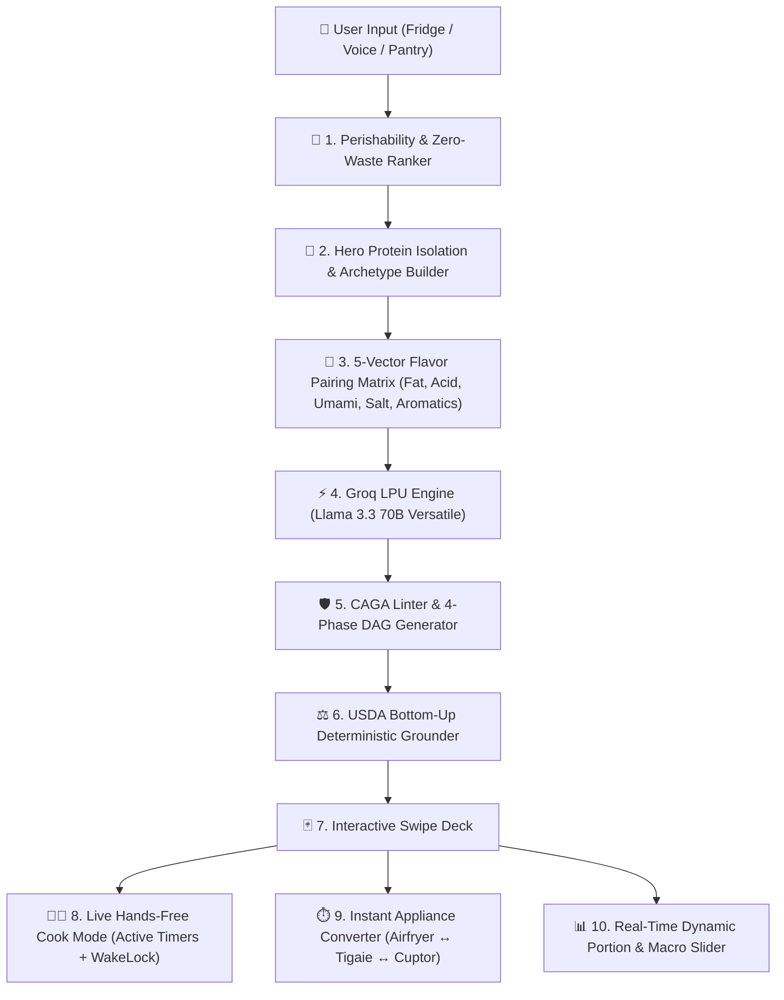

# BMAD Technical Specification & Deep Recon: Advanced Computational Gastronomy Engine for NutriAI

> **Document Type:** BMAD Technical Architecture & Deep Recon (Decision-Grade)  
> **Target System:** NutriAI (`d:\Intership\nutri-ai`)  
> **Status:** Approved for Implementation  
> **Foundational References:** FlavorGraph, RecipeDB (IIIT-Delhi), FoodKG, Cooklang, Mealie, FlavorDB, USDA FoodData Central.

---

## Executive Summary

NutriAI evolves from a standard LLM recipe generator into an **Autonomous Computational Gastronomy Platform**. 
By combining **Molecular Flavor Chemistry**, **Directed Acyclic Action Graphs (DAGs)**, **Dynamic Appliance Transform Matrices**, and a **Real-Time Interactive Cook Mode with Voice & Timers**, NutriAI delivers an unmatched user experience that bridges elite sports nutrition with 3-star Michelin culinary precision.

---

## 1. Domain Foundations & Research Ecosystem

### 1.1 Academic Foundations
1. **RecipeDB & FlavorDB (Center for Computational Biology, IIIT-Delhi):**
   - 118,000+ categorized recipes across 26 global cuisines.
   - Formalized the mathematical distinction between **Positive Food Pairing** (Western cuisines: ingredients sharing chemical volatile compounds) and **Contrasting/Bridging Food Pairing** (Mediterranean & Asian cuisines: contrasting flavor vectors like acid cutting through heavy fats).
2. **FoodKG (Semantics-Driven Food Knowledge Graph):**
   - Triplet mapping: `(Ingredient) -[undergoes]-> (Culinary Operation) -[produces]-> (Nutritional Output)`.
3. **Cooklang Core Specification:**
   - Formal grammar for recipe parsing: `@ingredient{amount%unit}`, `#cookware{}`, `~timer{duration%unit}`.

### 1.2 Open-Source Benchmark Analysis

| System | Core Innovation | What NutriAI Adopts & Upgrades |
| :--- | :--- | :--- |
| **FlavorGraph / FlavorForge** | Chemical compound food embedding & flavor bridges | **5-Vector Sensory Balance Matrix** (Auto-balancing Fat, Acid, Umami, Salt, Aromatics). |
| **Mealie & Cooklang** | Interactive step-by-step cooking & timer parsing | **Live Hands-Free Cook Mode** with embedded auto-countdown timers and audio alerts. |
| **Tandoor Recipes** | Reactive ingredient scaling & cost breakdown | **Zero-Latency Dynamic Macro & Portion Slider** powered by local USDA tables. |
| **EverShelf** | Perishability & stock depletion tracker | **Zero-Waste Perishability Index** prioritizing expiring fridge ingredients. |
| **SideChef / KitchenStories** | Appliance-specific instruction adjustments | **Thermal Appliance Converter Matrix** (Airfryer $\leftrightarrow$ Skillet $\leftrightarrow$ Oven). |

---

## 2. Architectural Pillars of the New NutriAI Engine

### Module 1: The 5-Vector Flavor Pairing & Contrast Matrix (`flavorEngine.ts`)
Every culinary dish is evaluated against 5 sensory dimensions:
$$\vec{S} = \langle \text{Fat}, \text{Acid}, \text{Umami}, \text{Salinity}, \text{Aromatics} \rangle$$

- **Rule of Contrast:** If a dish has high Fat ($\ge 0.7$) and low Acid ($\le 0.2$) (e.g. Ribeye steak or fatty tuna), the engine automatically injects an acidic flavor bridge (*„Stropește cu zeamă de lămâie proaspătă sau adaugă 1 linguriță de oțet balsamic”*).
- **Rule of Aromatics:** High-starch or mild dishes automatically receive an aromatic lift (*usturoi zdrobit, cimbru, rozmarin, piper măcinat*).

### Module 2: Interactive Hands-Free Cook Mode (`CookModeModal.tsx`)
- **Wake Lock API Integration:** Prevents screen timeout while the user cooks with messy hands.
- **Automated Timer Extractor:** Regex engine identifies cooking times (e.g. `3-4 minute`, `15 min`, `30 sec`) and generates live countdown widgets with **Play / Pause / Reset** and acoustic notification on completion.
- **Step Navigation:** Large typography, high-contrast dark mode, progress bar, and 1-tap completion logging directly to the daily macro journal.

### Module 3: Dynamic Appliance Transform Matrix (`applianceConverter.ts`)
Translates recipes seamlessly between appliances using physical convection and conduction equations:

$$\text{Airfryer Temp} = T_{\text{Oven}} - 20^\circ\text{C}, \quad t_{\text{Airfryer}} = t_{\text{Oven}} \times 0.75$$
$$\text{Skillet Duration} = t_{\text{Airfryer}} \times 0.40 \quad (\text{la foc mediu-iute, 3-4 min/parte})$$

Allows the user to flip a switch: `[ Tigaie ]` $\leftrightarrow$ `[ Airfryer ]` $\leftrightarrow$ `[ Cuptor ]` and see instructions, temperatures, and times rewrite instantly.

### Module 4: Real-Time Reactive Portion & Calorie Scaler (`macroScaler.ts`)
- Slider from $0.5\times$ to $3.0\times$ servings (or dynamic $\pm 300\text{ kcal}$ fine-tuning).
- Adjusts ingredient weights deterministically and re-aggregates total Calories, Protein, Carbs, and Fats using the local USDA database in $<1\text{ms}$ with zero network overhead.

### Module 5: Zero-Waste Perishability Index (`perishabilityRanker.ts`)
Assigns shelf-life scores $\lambda_i \in [1, 5]$:
- $\lambda = 5$ (Critic: $1\text{-}2\text{ zile}$): Somon proaspăt, Pește, Fructe de mare, Spanac fraged.
- $\lambda = 3$ (Mediu: $4\text{-}7\text{ zile}$): Carne de vită/pui, Ouă, Telemea, Avocado copt.
- $\lambda = 1$ (Stabil: luni): Conserve de ton, Orez basmati, Paste, Cartofi, Ulei.

The swipe deck engine prioritizes $\lambda = 5$ ingredients in the first card deck.

---

## 3. Implementation Roadmap & Milestones

### Phase 1: Core Computational Gastronomy & Flavor Engine
- Build `src/lib/flavorEngine.ts` (Sensory vector evaluation, flavor bridges, taste tags).
- Build `src/lib/applianceConverter.ts` (Thermal formulas for Airfryer / Skillet / Oven).
- Build `src/lib/perishabilityRanker.ts` (Zero-waste fridge shelf-life prioritization).

### Phase 2: Interactive Hands-Free Cook Mode UI
- Build `src/components/swipe/CookModeModal.tsx` (Screen wake-lock, step progression, embedded live countdown timers, audio synthesizer chime).
- Wire Cook Mode launcher into `RecipeBottomSheet.tsx` and `SwipeDeck.tsx`.

### Phase 3: Real-Time Dynamic Macro & Portion Slider
- Build reactive scaling in `RecipeBottomSheet.tsx` (real-time portion multiplier $1\times, 2\times, 3\times$ and USDA macro recalculation).

### Phase 4: Full Verification & Unit Testing
- Create automated test suite validating timer parsing, appliance conversions, and flavor balancing.
- Verify production build (`npm run build` Exit Code: 0).
